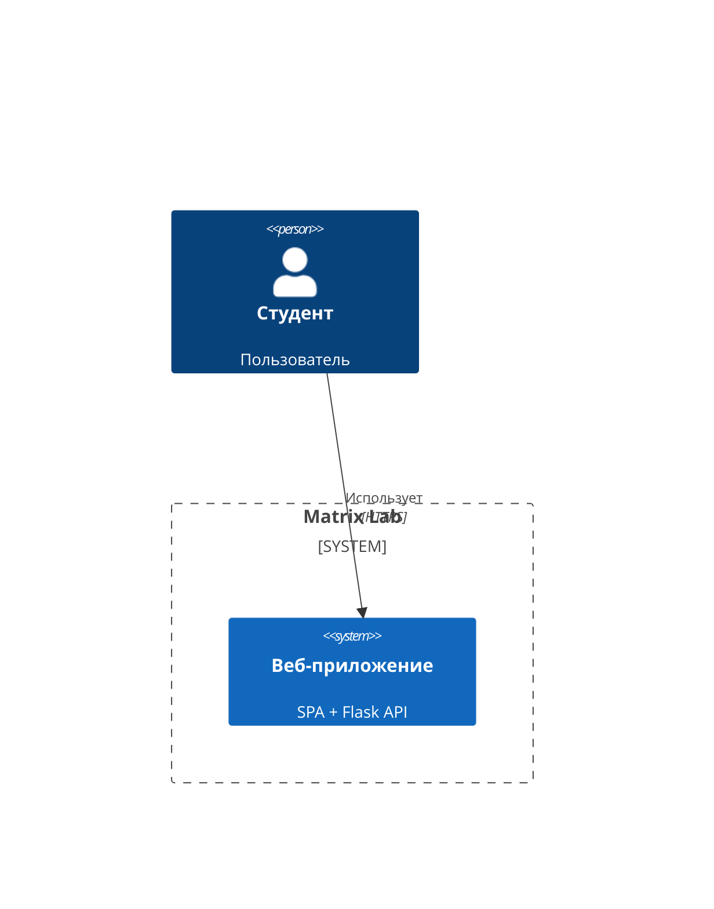
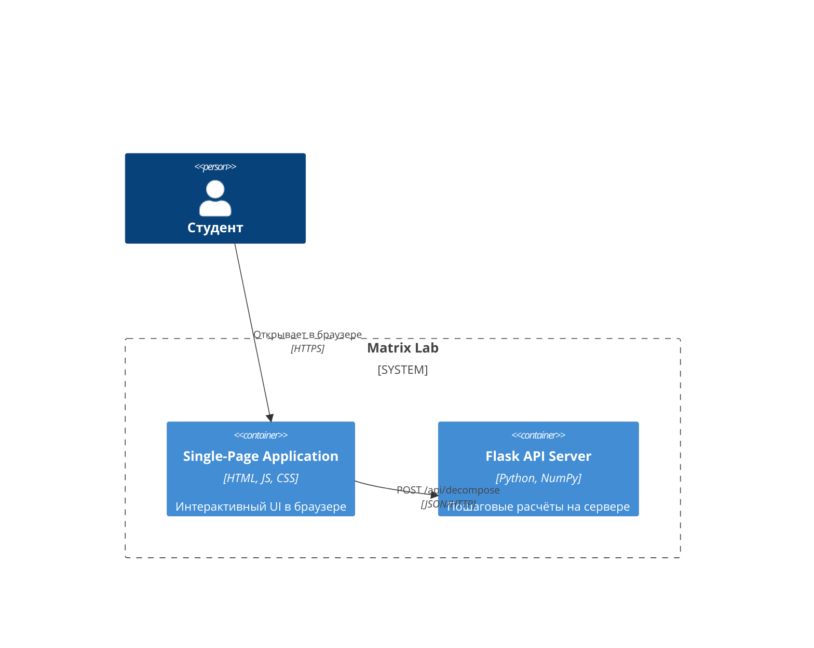

# Matrix Lab

Интерактивная лаборатория для изучения матричных разложений. Курсовой проект


## О проекте

Matrix Lab - веб-приложение для визуального и математического исследования матричных разложений. Создано как инструмент для изучения линейной алгебры: позволяет экспериментировать с матрицами, наблюдать работу алгоритмов в динамике и понимать математическую основу каждого разложения.

Проект сочетает интерактивную визуализацию и строгую математику:
- Визуализация матриц через тепловые карты (viridis / diverging)
- Итеративные алгоритмы с отображением сходимости
- Пошаговые расчёты для матриц как в учебнике

## Вкладки приложения

| Вкладка | Описание |
|---------|----------|
| **Визуализатор** | Редактор матриц (инлайн-ввод, изменение размера, колёсико для +/-0.1) + быстрые пресеты (Единичная, Нулевая, Случайная, Пример) + пошаговый пайплайн разложения с цветовыми стрелками операций (умножение, транспонирование, нормализация, собственные значения, инициализация). Для каждого алгоритма визуализируются шаги, матрица восстановления, график сингулярных чисел, ошибка. Для итеративных методов (NMF, ALS) - слайдер по итерациям |
| **Эксперименты** | Два исследования с пресетами матриц: (1) центр vs края - статистика ошибки по N случайным матрицам; (2) возмущение Delta в одной ячейке - радиальный распад влияния на восстановление, регулируется колёсиком мыши |
| **Теория** | Полный математический вывод каждого разложения для матрицы 2x2: характеристическое уравнение, собственные значения, собственные векторы, построение приближения |
| **Код** | Реализация каждого разложения на JavaScript (ES6) и Python с комментариями, примерами из жизни и кнопкой копирования |
| **Калькулятор** | Пошаговый расчёт через Flask-бэкенд: ввод матрицы 2-6x2-6, выбор итераций, анимированные шаги с LaTeX-формулами и тепловыми картами |

## Поддерживаемые разложения

- **SVD** (Singular Value Decomposition) - сингулярное разложение через numeric.js, усечение до ранга k
- **PCA** (Principal Component Analysis) - метод главных компонент: центрирование + SVD
- **NMF** (Non-negative Matrix Factorization) - неотрицательное разложение, мультипликативное обновление (MU), детерминированная инициализация от seed матрицы
- **CUR** - разложение по реальным строкам и столбцам: отбор топ-k по норме + псевдообратная через SVD
- **ALS** (Alternating Least Squares) - попеременные наименьшие квадраты с L2-регуляризацией, детерминированная инициализация
## 📊 Архитектура (C4 Model)

### 1. System Context Diagram



### 2. Container Diagram

## Структура проекта
```
matrix-factorization/
|
|-- assets/                    # Статические библиотеки и файлы
|   |-- katex.min.css          # Стили для математических формул
|   |-- katex.min.js           # Библиотека KaTeX
|   |-- numeric.min.js         # Библиотека для матричных операций
|
|-- dist/                      # Готовая версия приложения
|   |-- index.html
|
|-- src/                       # Основной JavaScript-код
|   |-- main.js                # Главный файл приложения
|   |-- visualizer.js          # Визуализация матриц и графиков
|   |-- decompositions.js      # Реализации алгоритмов (SVD, NMF, ALS и др.)
|   |-- calculator.js          # Пошаговый калькулятор
|   |-- heatmap.js             # Отрисовка тепловых карт
|   |-- theory.js              # Теоретические объяснения
|   |-- matrix.js              # Работа с матрицами
|   |-- dom.js                 # Вспомогательные DOM-функции
|   |-- experiments.js         # Экспериментальные функции
|   |-- code.js                # Работа с отображением кода
|   |-- palettes.js            # Цветовые схемы
|   |-- rng.js                 # Генерация случайных матриц
|   |-- styles.css             # Основные стили приложения
|
|-- server.py                  # Backend на Flask
|-- index.html                 # Главная страница приложения
|-- code.html                  # Страница с кодом и теорией
|-- README.md                  # Документация проекта
|-- .gitignore
```

## Как запустить локально

### Вариант 1 (быстрый) - только фронтенд:

```bash
python3 -m http.server 8080
```

Откройте в браузере: http://localhost:8080

### Вариант 2 (полный) - с backend:

```bash
# установите зависимости
pip3 install flask flask-cors numpy

# запустите бэкенд
python3 server.py
```

Бэкенд запустится на http://localhost:5000

Теперь запустите фронтенд (в другом терминале):

```bash
python3 -m http.server 8080
```

Запуск на удалённом сервере: https://matrix-lab.ru.tuna.am

## Технологии

- Frontend: чистый JavaScript (ES6)
- Backend: Flask + Python
- Математика: numeric.js (клиент) + NumPy (сервер)
- Формулы: KaTeX
- Визуализация: тепловые карты на CSS Grid

## Автор: Кибанова Екатерина Николаевна
